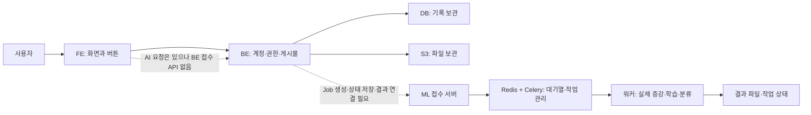

> **10월 9일 후속 수정:** 전문가 인증 주소·알림 page·내 활동 빈 응답 처리를 수정했습니다. 아래는 최초 조사·과거 커밋 설명이며 최신 상태는 [회의 준비 자료](//wsl.localhost/Ubuntu-24.04/home/ysb/projects/BIFUSION/BIFUSION-FE/docs/2026-10-09_Integrated_Meeting_Brief.md)와 [수정·검증 상세](//wsl.localhost/Ubuntu-24.04/home/ysb/projects/BIFUSION/BIFUSION-FE/docs/2026-10-09_Quickfix_Followup.md)를 확인하세요.

> 추가 첨부 ML 질의응답과 초기 명세까지 합친 [최신 통합본](//wsl.localhost/Ubuntu-24.04/home/ysb/projects/BIFUSION/BIFUSION-FE/docs/2026-10-09_Integrated_Meeting_Brief.md)을 우선 참고하세요.

# BIFUSION 회의 준비·작업 인수인계 — 2026-10-09

## 1. 회의 전에 먼저 이해할 결론

**화면과 일반 서비스 API 연결은 상당히 진행됐다. 그러나 핵심인 ‘이미지 증강 → 모델 학습 → 새 이미지 분류’가 실제 서버에서 끝까지 작동한다고 볼 근거는 부족하며, 현재 기본 브랜치의 FE·BE 사이에 연결이 빠져 있다.** 전문가 검수에도 요청/응답 불일치가 남아 있다.

지금 가장 헷갈리기 쉬운 것은 ‘화면이 있음’, ‘요청 함수가 있음’, ‘서버와 약속이 맞음’, ‘실제 서버에 저장되고 다시 조회됨’이 서로 다른 단계라는 점이다. 현재 여러 화면은 실제 API와 예시 데이터를 섞어 보여준다. 보기 좋은 화면이나 ‘연동 완료’라는 커밋 제목만으로 기능 완료를 판단하면 안 된다.

오늘의 우선 과제는 네 가지다.

1. AI 작업을 연결할 BE 담당과 배포할 ML 버전을 정한다.
2. FE가 서버 실패를 예시 성공으로 바꾸는 부분을 실제 서비스에서 분리한다.
3. 전문가 인증·검수의 주소/방식/항목/실제 번호를 맞춘다.
4. Notion 명세를 현재 구현으로 정정하고 실제 사용 시험을 별도로 기록한다.

**오늘 확인한 범위:** Git 원격 최신 브랜치, FE·BE·ML 소스, 본인 커밋, 개발/장애 기록, 첨부 API 명세 사진 8개. 이번 분석은 실제 운영 계정으로 새 게시물·검수·AI 작업을 실행한 결과가 아니다. 배포 서버가 어느 커밋을 실행하는지, 현재 GPU/가중치/S3 설정이 준비됐는지는 확인되지 않았다.

## 2. ‘최신’이 여러 종류인 이유

브랜치는 서로 다른 작업을 보관하는 코드의 갈래다. 커밋은 특정 시점의 변경 기록, PR은 변경을 검토하고 합치는 요청, 병합은 그 작업을 기준 갈래에 합치는 행위다. 로컬은 내 컴퓨터, 원격은 GitHub 저장소다. 배포는 코드를 실제 서버에서 실행하도록 올리는 별도 단계다.

| 저장소 | 10월 9일 확인 기준 | 해석 |
|---|---|---|
| FE 원격 main | faaaf424, 10월 7일 PR #58 병합 | 최신 랜딩 디자인 포함. 일반 API/AI 코드가 새로 완성된 병합은 아님 |
| FE 로컬 main | 69ec3015, 9월 30일 | 최신 원격보다 랜딩이 오래됨. 로컬에만 진행률 아키텍처 제안 문서 커밋도 있음 |
| BE develop | a7825f26, 9월 4일 | 현재 비교의 BE 기준 |
| BE main | b9678646, 9월 4일 | develop과 실제 소스 차이 없음 |
| BE 공개 프로필 #195 관련 브랜치 | 39e402a1, 9월 8일 | 기본 브랜치에 합쳐지지 않은 확장 작업. publicActivities 등을 이 코드 기준으로 완료라고 하면 안 됨 |
| ML main | a33ad896, 8월 30일 | 본인이 만든 최초 서버 뼈대와 DDPM 구현 |
| ML Medfusion | f473b602, 10월 2일 | 김성한님 변경. main에는 아직 미병합. 새 생성 방식·의존성·실패 처리 포함 |

[FE PR #58](https://github.com/NoDataNoLife/BIFUSION-FE/pull/58)은 이미 병합됐다. 이전 원격 main 28816ee와 최신 원격 main 사이의 최종 파일 차이는 **LandingPage.tsx 하나**다. 따라서 아래 API 불일치가 그 PR 병합으로 해결되지는 않았다. 디자인 변경과 기능 연동 작업을 분리해서 보면 이해하기 쉽다.

9월 13일의 진행률 제안 문서 c3fd5e6은 로컬 main에 있지만 최신 origin/main의 조상 커밋이 아니다. 즉 **문서를 내 컴퓨터에 커밋한 것과 팀 저장소에 공유한 것도 다르다.** 9월 30일 69ec301은 병합 기록이며 새 서비스 기능을 추가한 작업으로 해석하면 안 된다.

원격 참조를 갱신해 비교했지만 사용자 작업 브랜치를 변경하거나 현재 코드에 최신 랜딩을 덮어쓰지는 않았다.

## 3. 프로젝트가 어떻게 작동해야 하는가

FE(프론트엔드)는 사용자가 보는 화면이다. BE(백엔드)는 로그인, 권한, 프로젝트, 게시물과 작업 기록을 관리하는 서버다. ML 서버는 이미지 생성과 모델 계산을 수행한다. DB는 오래 보관할 기록, S3는 이미지와 결과 파일을 보관하는 파일 창고다.

아래 그림에서 점선은 현재 기본 BE에서 연결 구현을 확인하지 못한 구간이다.

AI 계산은 오래 걸린다. 비동기 작업은 요청을 받은 즉시 작업 번호를 주고 계산은 뒤에서 하는 방식이다. Job은 그 계산 한 건이다. 워커는 계산을 실행하는 프로그램, Celery는 워커에게 작업을 전달하는 관리자, Redis는 작업 대기열/임시 상태 보관에 쓰이는 도구다.

원하는 연결은 다음과 같다.

1. 사용자가 이미지를 고른다. **실제 이미지 내용**을 서버에 전달한다.
2. BE가 권한을 확인하고 작업 기록을 만든 뒤 ML에 계산을 맡긴다.
3. BE 작업 번호와 ML 작업 번호를 함께 저장한다.
4. FE는 상태를 조회해 진행률/실패/완료를 표시한다.
5. 증강 성공 결과의 dataset_id를 학습 입력으로 넘긴다.
6. 학습 성공 결과의 model_id를 새 이미지 분류 입력으로 넘긴다.
7. 결과 파일 위치와 최종 상태를 기록해 새로고침 후에도 이어볼 수 있게 한다.

현재 FE는 1.5초마다 상태를 묻는 **폴링**을 사용한다. SSE는 서버가 연결을 유지하며 변경을 보내주는 방식이다. 명세서의 SSE 행과 현재 폴링 코드는 같은 것이 아니다. 9월 진행률 문서도 ‘제안서’이며 BE 구현 증거가 아니다. BE가 상태를 기록하는 방법은 폴링·콜백 등으로 합의할 수 있지만, 조회 복구와 최종 기록 보존은 필요하다.

근거: [FE Job 상태](//wsl.localhost/Ubuntu-24.04/home/ysb/projects/BIFUSION/BIFUSION-FE/src/store/useJobStore.ts), [폴링 코드](//wsl.localhost/Ubuntu-24.04/home/ysb/projects/BIFUSION/BIFUSION-FE/src/hooks/useJobPolling.ts), [BE Job 접수 코드](//wsl.localhost/Ubuntu-24.04/home/ysb/projects/BIFUSION/BIFUSION-BE/src/main/java/com/nodatanolife/bifusion_be/domain/job/controller/JobController.java), [본인 진행률 제안](//wsl.localhost/Ubuntu-24.04/home/ysb/projects/BIFUSION/BIFUSION-FE/docs/2026-09-04_Job_Progress_UI_Architecture_Proposal.md).

## 4. 최근 작업의 흐름

| 시기 | 실제 진행된 일 | 지금 의미 |
|---|---|---|
| 7월 | 커뮤니티 목록/등록, 서버 주소, S3 파일 주소 관련 연결 | 화면 예시를 실제 서비스 데이터로 바꾸기 시작 |
| 8월 7~17일 | 배포 경로, 데이터셋 업로드·다운로드·삭제, Q&A, 팀원 모집, 검수 화면 | 일반 기능이 늘어남. 일부 결과/후기는 예시로 남음 |
| 8월 18~26일 BE | 파일 다운로드, 전문가 성과·검수, 알림, 내 활동 조회·권한 보완 | 명세 사진의 시작 전 표시가 낡아짐 |
| 8월 20~26일 FE | 내 자산, 알림, 전문가 작업 목록, 공개 설정, 다크모드 | 요청 연결과 디자인 작업이 여러 PR에 섞임 |
| 8월 30일 ML | 본인이 FastAPI·Celery·저장소·3개 작업 서버 뼈대 작성 | 서버 코드가 생긴 단계. 배포/전체 연결 완료와 별개 |
| 9월 1~4일 | FE 구글 로그인 주소·세션 복원; BE 검수/전문가 조회 500 수정 | 기본 로그인과 서버 오류 대응 |
| 9월 13~14일 | 데이터셋 수정, AI Setup→Progress→Result, 내 활동 API 요청을 PR #55~57로 병합 | AI는 요청 가정과 모의 실행 포함. 검수 신청 규격도 여전히 다름 |
| 9월 22~25일 ML | DDPM→Medfusion, 생성 로직을 외부 bifusion 패키지로 이동, 가짜 성공 제거 | 기존 배포 절차를 그대로 쓰면 부족함 |
| 9월 30일 FE 로컬 | 원격 병합 + 로컬 제안 문서 기록 | 새로운 일반 서비스 API 완성 작업 아님 |
| 10월 2일 ML | eye VAE 및 업로드별 짧은 추가 학습으로 증강 방식 변경 | 새 모델 파일과 외부 패키지 버전을 준비해야 함 |
| 10월 7일 FE | 랜딩 워크플로 디자인 PR #58 병합 | 화면 소개 개선. 미연동 API 해결과 별개 |

PR별로 보면 [#55 데이터셋·검수 신청](https://github.com/NoDataNoLife/BIFUSION-FE/pull/55), [#56 AI 진행 화면](https://github.com/NoDataNoLife/BIFUSION-FE/pull/56), [#57 마이페이지·알림](https://github.com/NoDataNoLife/BIFUSION-FE/pull/57), [#58 랜딩](https://github.com/NoDataNoLife/BIFUSION-FE/pull/58) 순서다.

## 5. 내가 올린 커밋을 쉽게 해석하면

Git 작성자 yeomseungbeen / Seungbeen Yeom 기록을 본인 작업으로 묶었다. 병합 커밋의 작성자와 그 안의 실제 코드 작성자는 다를 수 있다. 다른 사람이 작성한 랜딩 변경을 내가 병합했다고 해서 직접 그 기능을 구현한 것은 아니다.

### FE에서 특히 알아야 할 작업

| 날짜·커밋 | 쉬운 설명 | 현재 남은 과제 |
|---|---|---|
| 8/24 2144e4d | 데이터셋 주소를 /datasets로 옮기고 검수 상세/저장 요청을 추가 | 검수 상세 응답 이름·실제 번호 미완성 |
| 8/25 3061a16 | 내 자산 목록과 검수 판정 요청을 붙이려 한 변경 | 제목의 ‘Mock 제거/동기화’와 달리 상세 예시·POST 판정 불일치가 남음 |
| 8/25 857de3d | 내 레시피 목록 조건을 서버의 MINE으로 맞춤 | 상세·Fork·후기까지 완료된 것은 아님 |
| 8/25 a86a7f6 | 전문가 목록을 /experts/me/tasks와 상태별 묶음 응답으로 맞춤 | taskId를 직접 받지 못하고 표시 코드에서 추정 |
| 8/26 1df0a15, 9ea73e3 | 알림 삭제 요청과 다른 사용자 프로필 화면/이동 추가 | 예시 프로필·작성자 번호·실패 처리, 공개 활동 확장 BE 작업 확인 |
| 8/26 972f62d | 학습·추론 화면의 다크모드 색상 작업 | 색상 완성과 AI 실제 계산 완성은 별개 |
| 9/1 81ff748, 3a4495b | 구글 로그인 주소 복구, 랜딩 문구·공개 활동 매핑 정리 | 공개 활동 응답이 기본 BE에 없는 상태와 맞춰야 함 |
| 9/4 d7bb03c | 새로고침 때 쿠키 로그인 복원, 인증 실패 무한 이동 방지 | 만료/비로그인/재발급 흐름 실서버 재검증 |
| 9/13 0c5da43 | 데이터셋 수정 주소 /datasets/{id}/upload 반영, 파일 재첨부 강제 해제 | 비교적 구체적인 규격 수정. 저장 후 다시 조회 확인 |
| 9/13 6b6d7b2 | 커뮤니티 데이터셋에서 검수 신청 요청 추가 | RECIPE/DATASET와 reward를 보내므로 현 BE 지원 대상/항목과 다름 |
| 9/13 2ec5b06 | AI 작업 생성·상태 조회·취소를 한 저장소로 묶고 시연용 모의 작업 추가 | 어떤 서버 오류든 예시 작업으로 바뀌는 구조가 핵심 문제 |
| 9/13 825e89e | 증강 설정→진행→결과 화면을 작업 저장소에 연결 | 파일은 장수만 보내고 BE 접수 API가 없음 |
| 9/13 6bd5d6a | 학습 설정→진행→결과 화면 연결 | 증강 목록이 고정값, 실제 dataset_id가 이어지지 않음 |
| 9/13 df9543c | 분류 설정→진행→결과 화면 연결 | 모델 목록 고정, 실제 이미지/model_id 전달 필요 |
| 9/13 711df1d | 반복 조회 함수의 React 내부 처리 정리 | 진행률100만으로 성공 판정하는 문제는 남음 |
| 9/13 13c5486 | 내 활동 첫 목록과 공개 설정 요청 추가 | 다음 cursor 미사용·빈 목록 예시·공개/노출값 문제 |
| 9/13 c3fd5e6 | BE에 필요한 Job 구조를 문서로 제안 | 구현 커밋이 아님. 이 문서 커밋은 최신 원격 main에 미포함 |
| 9/30 69ec301 | 로컬에서 원격 main 변경을 병합 | 새 기능 추가로 오해하지 않기 |

즉 9월의 주된 성과는 **화면 흐름과 요청 코드를 준비한 것**이다. 마지막 구간인 서버 약속 정합성·실제 이미지 전달·저장·오류·새로고침 검증이 남았다.

### ML에서 내가 만든 것

8월 30일에 c3f3722(실행 패키지/Docker), 8a98788(설정), 776a576(모델 로더), 60ba7a0(파일 보관·이미지 변환), 5edecf0(DDPM/ProtoNet), f642472(요청 형식), cffcd21(증강), a778da9(학습), ee9130e(분류), a33ad89(테스트/더미 모델)가 들어갔다.

이것은 접수 API와 뒤에서 계산하는 구조를 만든 작업이다. 당시 일부 실패 상황을 랜덤 데이터/모델로 대신하는 코드가 있어서, 실행 성공 표시 자체가 유효한 결과를 의미하지 않는다. 테스트 중 모의 접수 시험도 실제 GPU·Redis·S3 전체 연결 시험과 다르다. ‘더미 모델’은 실행 형태를 시험하려고 만든 예시 가중치이며, 실제 학습을 검증한 모델과 구분해야 한다.

## 6. 기능별 현재 상태와 사용자에게 보이는 문제

| 기능 | 확인한 진행 | 사용자가 만날 수 있는 문제 | 다음 작업 |
|---|---|---|---|
| 로그인·기본 회원 정보 | 쿠키 기반 로그인, 내 정보·수정·탈퇴 호출 있음 | 만료/운영 서버 장애는 별도 | 로그인→새로고침→수정→재조회 시험 |
| 프로젝트·멤버 | 생성/조회/수정/초대 생성/역할/삭제 요청 있음 | 받은 초대 수락·거절 경로, 배너 파일, 전체 프로젝트 삭제 미완성 | 초대 ID 확보 경로와 배너·삭제 범위 합의 |
| 커뮤니티 Q&A·모집 | 목록/상세/작성/지원/승인 등 실제 호출 | 목록 첫 페이지·정렬, 작성자 번호 일부 예시 | 저장/권한/다음 페이지 연결 확인 |
| 일반 데이터셋 | 파일 임시 업로드·등록·수정·다운로드·삭제 호출 | 커뮤니티 상세 예시 혼합, 파일 권한/만료 확인 필요 | 실제 상세·fileId·저장 후 재조회 |
| 레시피 | 등록/목록/삭제와 내 자산 목록 호출 | 상세/Fork 함수는 화면에서 미사용. 가짜 설정/평점/후기 | 상세→실제 Fork→내 자산 재조회 연결 |
| 알림 | 목록/읽음/단건 삭제 UI와 호출 | 실패해도 로컬 성공, 페이지 번호 불일치, 예시 알림 잔존 | 오류 처리·빈 목록·페이지·전체 삭제 버튼 정리 |
| 마이페이지 | 내 활동 첫20개·공개 설정 요청 있음 | 빈 목록에도 예시, 다음 페이지 미조회, 공개값 의미 혼동 | cursor·type+id 식별·BE 노출 응답 보완 |
| 전문가 인증·검수 | 목록/시작/상세/임시 의견/판정 요청 존재 | 인증 주소·판정 Method/항목·대상·실제 번호·응답 이름 불일치 | FE와 BE 공동 수정 |
| 전문가 통계·검수 결과 | 화면 있음 | 고정 통계와 예시 결과로 실제 상태 오인 | 실적 API·실제 inspectionResult 사용 |
| AI 증강/학습/분류 | 설정·진행·결과 화면과 폴링 코드 있음 | 서버 실패→모의 성공, 이미지 미전송, 작업 기록 미복구 | BE 연결 API·실데이터·실패·기록 보존부터 |

### AI 화면의 가장 큰 문제: 실패해도 성공처럼 보일 수 있음

useJobStore의 주석은 BE-ML 연결 전에도 화면을 보여주기 위한 시연 캐시라고 설명한다. 따라서 시연 장치는 코드상 의도가 있다. 문제는 **서비스 요청 실패와 시연 진입을 구분하지 않는다**는 점이다.

지금 증강 시작을 누르면 FE는 POST /projects/{id}/jobs를 시도한다. 기준 BE의 JobController에는 댓글 작성/수정/삭제만 있고 이 접수 API는 없다. 오류가 나면 FE는 JOB-임의번호를 만들고 진행률을 무작위로 올린 뒤 SUCCESS와 고정 결과를 만든다. 모의 결과에는 ‘폐렴’, 94.2% 같은 값까지 들어간다. 실제 계산 결과로 해석하면 안 된다.

또한 파일 선택을 해도 증강에는 normalCount/anomalyCount, 학습에는 queryCount, 분류에는 imageCount 등 **장수만** 보낸다. 실제 이미지 내용은 그 요청에 들어 있지 않다. 정상/비정상 파일을 각 5장 이상 고르게 하는 UI가 있어도, 서버가 파일을 받은 증거는 아니다.

작업 캐시는 브라우저 메모리에만 있어 새로고침하면 사라진다. 조회가 실패하면 RUNNING 50%를 만들 수도 있다. 취소 API 실패도 무시하므로 계산이 실제로 멈췄다는 보장이 없다.

폴링은 SUCCESS/COMPLETED **또는 progress>=100**이면 결과 화면으로 이동한다. 진행률은 계산 단계 표시일 뿐 최종 파일 저장 성공 증거가 아니다. 최종 성공 상태에서만 이동해야 한다. ML의 외부 FAILED/error를 보여주는 실패 분기는 유지하고 서버 오류를 모의 작업으로 숨기지 않아야 한다.

### 검수는 FE의 작은 수정과 BE의 추가 응답이 함께 필요

| 항목 | 현재 FE | 현재 BE |
|---|---|---|
| 전문가 인증 | POST /users/me/expert | POST /experts/me, certificationFile |
| 검수 대상 신청 | RECIPE 또는 DATASET, reward | AUGMENTED_DATA만 허용, rewardPoints |
| 최종 승인 | POST + finalComment | PATCH + expertComment |
| 최종 반려 | POST + rejectionReason | PATCH + expertComment |
| 저장 의견 조회 | draftComment/finalComment 참조 | expertComment |
| 증강 설정 조회 | parameters 등 가정/예시 | augmentationParams |
| 상세 신청자 이름 | nickname 가정 | requester.name |
| 검수 작업 번호 | reviewCode 문자열에서 숫자 추출 | ExpertTask의 실제 DB 번호 필요 |

주소/Method를 고치는 작업은 FE에서 할 수 있다. 하지만 허용 검수 대상, 실제 증강 설정 번호, 실제 작업 번호 제공은 BE와 맞춰야 한다. ‘DATASET을 AUGMENTED_DATA로 문자열만 바꾸기’는 충분하지 않다. 본인 소유의 증강 설정을 검수 대상으로 선택하는 화면과 실제 ID가 필요하다.

점수·전문가 이름·결과 날짜가 고정된 검수 결과 창도 실제 응답으로 바꿔야 한다. 데이터가 없거나 API가 실패하면 예시 이미지를 검수 대상으로 보여주지 않아야 한다.

근거: [FE 인증](//wsl.localhost/Ubuntu-24.04/home/ysb/projects/BIFUSION/BIFUSION-FE/src/store/useAuthStore.ts:231), [FE 검수 요청](//wsl.localhost/Ubuntu-24.04/home/ysb/projects/BIFUSION/BIFUSION-FE/src/store/useExpertStore.ts:138), [FE 신청 대상](//wsl.localhost/Ubuntu-24.04/home/ysb/projects/BIFUSION/BIFUSION-FE/src/store/useCommunityStore.ts:408), [BE 전문가 인증](//wsl.localhost/Ubuntu-24.04/home/ysb/projects/BIFUSION/BIFUSION-BE/src/main/java/com/nodatanolife/bifusion_be/domain/expert/controller/ExpertController.java:41), [BE 검수](//wsl.localhost/Ubuntu-24.04/home/ysb/projects/BIFUSION/BIFUSION-BE/src/main/java/com/nodatanolife/bifusion_be/domain/expert/controller/InspectionController.java), [BE 상세 응답](//wsl.localhost/Ubuntu-24.04/home/ysb/projects/BIFUSION/BIFUSION-BE/src/main/java/com/nodatanolife/bifusion_be/domain/expert/dto/response/InspectionDetailResponse.java).

### 공개 설정은 두 개념을 구분해야 함

콘텐츠 자체 공개(isPublic)와 마이페이지에 보이기(isMyPageVisible)는 다르다. 예를 들어 공개 커뮤니티 글을 내 프로필에서는 숨길 수 있다. 현재 BE 변경은 프로필 노출값을 저장하는데 내 활동 응답은 콘텐츠 공개값을 반환한다. FE가 같은 스위치 값으로 읽으면 새로고침 후 표시가 어긋날 수 있다.

FE는 활동 종류와 번호를 함께 식별해야 한다. 레시피1과 데이터셋1은 서로 다른 글인데 id=1만으로 찾으면 동시에 바꾸거나 엉뚱한 것을 선택할 수 있다.

[FE 프로필 처리](//wsl.localhost/Ubuntu-24.04/home/ysb/projects/BIFUSION/BIFUSION-FE/src/pages/dashboard/ProfilePage.tsx:469), [BE 활동 조회](//wsl.localhost/Ubuntu-24.04/home/ysb/projects/BIFUSION/BIFUSION-BE/src/main/java/com/nodatanolife/bifusion_be/domain/user/dto/response/MyActivityListResponse.java), [BE 노출 변경](//wsl.localhost/Ubuntu-24.04/home/ysb/projects/BIFUSION/BIFUSION-BE/src/main/java/com/nodatanolife/bifusion_be/domain/user/service/MyActivityVisibilityServiceImpl.java).

## 7. 팀원이 바꾼 ML을 이해하는 데 필요한 내용

김성한님은 별도 Medfusion 브랜치에서 다음을 바꿨다.

| 변경 | 쉬운 뜻 | FE/배포에 미치는 영향 |
|---|---|---|
| 9/22 ec45007: DDPM→Medfusion | 이미지를 생성하는 핵심 엔진 변경 | 새 코드·모델 가중치가 필요 |
| 9/22: 실패 시 가짜 대체 제거 | 데이터/모델/이미지가 없으면 실제 실패를 반환 | FE도 실패를 가짜 성공으로 바꾸면 안 됨 |
| 9/25 0ba9115: bifusion 패키지로 이동 | 실제 생성 계산을 별도 코드 묶음에 맡김 | 이 저장소만 가져가서는 배포에 부족 |
| 10/2 6ce8886: eye VAE·업로드별 추가 학습 | 사진을 압축/복원하는 모델을 통일하고 업로드 이미지에 맞춰 짧게 적응 후 변형본 생성 | 모델 파일·외부 패키지 버전·GPU 시간 필요 |
| 10/2 f473b60: 인수인계 문서 개정 | 바뀐 배포·데이터 조건 설명 | 최신 문서와 실제 코드 둘 다 확인 |

Medfusion은 의료 이미지 생성 엔진 이름이다. VAE는 이미지를 작은 내부 표현으로 압축했다가 복원하는 모델이다. eye는 사용한 사전학습 체크포인트의 안저 이미지 계열 이름이며, ‘우리 서비스가 눈 사진만 지원한다’는 기능 판정과는 다르다. 파인튜닝은 이미 학습된 모델을 새 입력에 맞춰 추가로 조금 학습하는 방식이다.

ProtoNet은 정상·비정상 각각의 대표 특징을 만들어 새 사진이 어느 쪽에 가까운지 분류하는 모델이다. K-shot은 각 종류에서 대표 예시를 몇 장 쓰는지를 뜻한다. **현재 모델 출력은 NORMAL/ANOMALY 이진 분류이며, 화면 예시의 심장질환·폐암·폐렴 같은 질병 이름이 실제 구현된 진단 기능이라고 볼 수 없다.**

### 데이터는 이렇게 이어져야 함

| 단계 | ML 실제 접수 | 필요한 입력 | 성공 결과 |
|---|---|---|---|
| 증강 | POST /api/v1/augmentation/run | normal_images_base64, anomaly_images_base64, num_samples_per_class 등 | dataset_id, dataset_url, preview_url, 실제 수량 |
| 학습 | POST /api/v1/training/run | 성공한 dataset_id, k_shot, epochs 등 | model_id, model_url, metrics |
| 분류 | POST /api/v1/inference/run | 성공한 model_id와 images_base64 | predictions: NORMAL/ANOMALY, confidence, probabilities |

각각 GET /api/v1/{augmentation|training|inference}/{job_id}로 상태를 조회한다. 이 주소는 **ML API**이며 Notion의 프로젝트별 **BE API**와 별개다. BE에서 변환·권한·기록을 연결해야 한다.

base64는 이미지 파일을 요청에 넣기 위해 문자로 표현한 것이다. metrics는 정확도 등 모델 평가 수치, npz는 배열 데이터 묶음 파일, pt/pth는 모델 가중치 파일 형식으로 쓰이는 확장자다. 현재 ML 산출물은 support_aug.npz와 best.pt다. 명세의 PTH 다운로드 문구도 실제 전달 파일에 맞춰야 한다. confidence는 모델의 출력 확신 정도이며 실제 의료 정확도를 보증하는 값은 아니다.

### 문서에도 서로 안 맞는 부분이 있음

**최신 README는 여전히 무조건부 생성/추가 학습 미구현이라고 쓰는 부분이 있지만, 10월 2일 MIGRATION과 워커 코드는 업로드별 추가 학습을 사용한다.** 코드상 증강은 augment_with_finetune을 호출한다. README의 옛 설명을 현재 동작으로 인용하면 안 된다.

또 README/MIGRATION의 일부 예시는 API status=FAILURE라고 적지만 실제 라우터는 Celery 내부 FAILURE를 외부 FAILED로 바꾼다. FE가 FAILED를 확인하는 것 자체는 현재 ML 외부 상태와 맞다. ‘문서에 FAILURE라고 되어 있으니 FE 실패 상태가 반드시 틀렸다’고 결론 내리면 안 된다. 현재 문제가 되는 것은 누락된 연결과 오류를 예시로 바꾸는 흐름이다.

이것이 ‘최신 문서 기준’보다 ‘실제 요청 접수·응답 변환 코드 기준’으로 명세를 확인해야 하는 이유다.

### 배포 전에 확인할 것

- ML main과 Medfusion 중 사용할 커밋, 외부 bifusion 패키지 버전을 확정한다.
- bifusion 패키지, medical_diffusion 소스, diffusion/VAE 체크포인트 두 개를 실제 서버에 준비한다.
- 설정의 개발자 Windows 절대경로를 서버/컨테이너 내부 경로로 맞춘다.
- RGB(3채널)/흑백(1채널) 설정을 생성·학습·분류에서 일관되게 사용한다. 최신 기본값은 RGB다.
- 산출물을 다음 워커가 읽을 수 있는 공유 저장소 또는 S3 읽기 경로를 연결한다. 현재 Compose는 주로 /app/models만 공유한다.
- 세 큐에 각 concurrency=1이어도 서로 다른 작업 세 개는 동시에 실행될 수 있다. 전체 GPU 제한을 별도로 확인한다.
- 모델 파일이 존재한다는 사실과 실제 유효하게 학습된 가중치라는 사실을 구분한다.

이 목록은 ‘오늘 서버에서 다 실패했다’는 보고가 아니라 **현재 저장소 구성으로 배포 준비를 확인할 항목**이다. GPU·가중치·외부 패키지를 사용하는 실행 시험은 이번에 수행하지 않았다.

근거: [최신 MIGRATION](https://github.com/NoDataNoLife/BIFUSION-ML/blob/f473b6024b31355c9be75a6bcb9779919c49131d/MIGRATION.md), [실제 증강 워커](https://github.com/NoDataNoLife/BIFUSION-ML/blob/f473b6024b31355c9be75a6bcb9779919c49131d/app/workers/augmentation_worker.py), [상태 변환 코드](https://github.com/NoDataNoLife/BIFUSION-ML/blob/f473b6024b31355c9be75a6bcb9779919c49131d/app/routers/augmentation.py), [배포 구성](https://github.com/NoDataNoLife/BIFUSION-ML/blob/f473b6024b31355c9be75a6bcb9779919c49131d/docker-compose.yml).

## 8. 지난 문제를 회의에서 다시 따라갈 목록

과거 문서·첨부 ML 답변·커밋을 현재 코드에 대조했다. GitHub FE 이슈 검색은 빈 결과였고 BE/ML 이슈 검색은 접근 오류였다. 따라서 온라인 이슈 댓글/종료 상태까지 모두 확인했다는 의미는 아니다.

| 지난 문의·문제 | 현재 소스에서 확인 | 회의에서 요청할 후속 |
|---|---|---|
| S3 이미지 403 | 서명 URL을 다시 인코딩하지 않도록 한 변경 있음 | 실제 파일 표시, 주소 만료 후 재조회 |
| 데이터셋 다운로드/주소 이전 | /datasets와 /files/{fileId}/download 반영 | 실제 파일 저장 후 열어보기. AI 결과 다운로드와 구분 |
| 데이터셋 수정 때 파일 필수 | 9/13 기존 파일 유지 가능하게 변경 | 파일 재첨부 없이 저장 후 재조회 |
| 팀원 모집 중복 지원 | 409 안내와 이미 지원 상태 처리 있음 | 두 번 지원해도 중복 기록 안 생기는지 |
| 전문가/검수 목록 500 | BE 9/4 빈 값/중복 방어 수정 반영 | 현재 배포 커밋·실제 데이터에서 재확인 |
| 초대 수락·거절 | BE PATCH는 있으나 FE 미연결 | 수신자가 projectId/invitationId를 받는 흐름 |
| 공개 프로필 활동 | #195 확장 브랜치에 작업 있음, 기본 브랜치 미반영 | 병합/배포 여부와 FE publicActivities 대응 |
| 로그인/새로고침 | FE 9/1 주소·9/4 세션 복원 변경, vercel 경로 설정 있음 | 만료·로그아웃·직접 URL 새로고침 시험 |
| AI 취소 | FE 가정 주소만 있음. ML 취소 접수 API 없음 | 대기 취소·실행 중 중단·종료 후 요청 규칙 |
| 취소 후 파일/GPU 회수 | 중단에 따른 자동 정리·운영 검증 없음 | 해당 작업 파일만 정리, 다음 작업 실행 증거 |
| 없는/만료된 ML 작업 번호 | AsyncResult가 알 수 없는 번호도 PENDING으로 볼 수 있음 | 미존재/만료/실제 대기 구분 및 404 정책 |
| 상태/결과 보존 | Celery 결과 만료 기간을 코드에 명시하지 않음, 영구 DB 기록 연결 없음 | 보존 기간·재시작·새로고침 복구 합의 |
| 단계 문구 currentStep | 워커의 message는 있으나 상태 GET에서 전달하지 않음 | BE가 단계 문구를 받을 방법 |
| 파일 위치 | ML은 결과 URL 중심이며 BE의 장기 저장 연결 없음 | 파일 key/bucket 기록, 필요할 때 임시 URL 재발급 |
| ML 입력/다음 작업 | base64 입력, 실제 dataset_id/model_id 연결 필요 | FE→BE→ML 입력 예시와 S3/공유 파일 읽기 |
| 외부 접근 가능한 ML 서버 | 코드/포트가 있다는 것과 배포 가능 주소는 별개 | 주소·접근 범위·권한·GPU·커밋 기록 |

403은 권한 때문에 거절, 404는 대상을 찾지 못함, 409는 중복/상태 충돌, 500은 서버 처리 오류다. 과거 로그인 502 기록은 지금도 같은 장애가 있다는 뜻이 아니므로 재현 없이 현재 장애로 단정하지 않는다.

## 9. 명세서에서 고쳐야 하는 핵심

사진에서 보이는 **84개 항목의 대조표와 CSV**를 별도 파일로 만들었다.

- [API 대조표](//wsl.localhost/Ubuntu-24.04/home/ysb/projects/BIFUSION/BIFUSION-FE/docs/2026-10-09_API_Spec_Reconciliation.md)
- [Notion 비교용 CSV](//wsl.localhost/Ubuntu-24.04/home/ysb/projects/BIFUSION/BIFUSION-FE/docs/2026-10-09_API_Spec_Reconciliation.csv)

‘시작 전’에서 올려야 하는 대표 항목은 알림 목록/읽음/단건 삭제, Q&A 상세/삭제, 모집 상세/지원/승인, 레시피 등록/목록/삭제, 내 자산 목록, 내 활동 첫 목록, 프로젝트 생성이다. 다만 대부분은 ‘요청 연결 또는 부분 연결’이며 모두 실서버 완료로 올리면 안 된다.

주소 수정은 데이터셋 등록/상세/삭제의 /datasets, 수정의 /datasets/{id}/upload, 자산 목록의 /assets/datasets·/assets/recipes, 레시피의 /community/recipes, 검수 상세/저장의 /inspections, 다운로드의 /files/{fileId}/download가 핵심이다. 멤버 삭제는 PUT이 아니라 DELETE, 알림 단건 삭제는 /notifications/{id}가 아니라 ?notificationId=...다.

레시피 Fork 후 새 글을 등록하는 기능은 PUT /recipes/{id}가 아니다. BE는 POST /community/recipes에 forkedFromId를 넣는 등록 방식이다. 기존 레시피를 수정하는 API가 이미 있다는 뜻으로 해석하지 않는다.

명세에는 BE/FE 상태와 함께 **실서버 확인 날짜/증거** 열을 추가하는 것을 권한다. API 구현, 화면 연결, 실제 저장 검증을 한 개의 완료 표시로 뭉치지 않는 것이 관리에 도움이 된다. 원본 Notion은 이번에 수정하지 않았다.

## 10. 오늘 회의에서 결정할 순서

| 순서 | 결정/과제 | 맡을 역할 | 완료 증거 |
|---|---|---|---|
| 1 | 실제 FE·BE·ML 배포 버전과 별도 작업 위치 확인 | 각 담당 | 실행 주소+커밋+브랜치 한 표 |
| 2 | 사용할 ML 버전과 외부 패키지/가중치 준비 | ML·배포 담당 | 선택 커밋, 파일 출처, 실제 환경 로딩 |
| 3 | Job 생성/상태/목록/결과 저장 연결 계약 | BE 중심, FE·ML 협의 | 실제 요청/응답 예시, 작업 번호 대응, 담당·기한 |
| 4 | 실패 시 모의 성공 분리, 이미지 실전송, 최종 상태 판단 | FE | 오류 때 성공 화면 안 뜸, 전달 이미지 확인 |
| 5 | 검수 인증/판정 규격·실제 ID·허용 대상 수정 | FE·BE | 신청→시작→저장→판정→결과 재조회 |
| 6 | FE 타입/빌드 오류 정리 | FE | 기존 build 명령 통과 |
| 7 | 레시피 상세/Fork/후기와 고정 결과 제거 | FE, 일부 BE 집계 보완 | 새로고침 후 복사본·후기 유지 |
| 8 | 알림 실패/빈 목록, 활동 공개 설정·페이지 개선 | FE·BE | 빈 상태·실패·다음 페이지·노출 재조회 |
| 9 | Notion 명세와 인수인계 문서 정정 | 기능 담당 공동 | 주소/상태/검증 날짜 맞음 |
| 10 | 실제 사용자 흐름 종합 시험 | FE·BE·ML 공동 | 성공·실패·권한·새로고침·파일 확인 기록 |

순서는 추천이다. 짧은 데모가 목적이라면 일반 기능/AI 중 반드시 실제로 보여줄 범위를 먼저 줄여 합의한다. 예시 화면은 예시라는 표시가 필요하며, 실제 AI 계산 완료 자료로 사용해서는 안 된다.

회의에서 확인할 질문:

1. 지금 서버에서 실행 중인 FE/BE/ML의 커밋은 무엇인가?
2. Job 생성·상태 조회·ML 연결을 다른 브랜치에서 구현 중인가? 있다면 브랜치와 담당/기한은?
3. Medfusion을 기준으로 병합/배포할 것인가? 외부 패키지와 두 모델 파일은 누가 준비하나?
4. 검수 지원 대상은 본인 증강 데이터만 유지할 것인가? FE가 사용할 실제 taskId/augmentationConfigId를 어떻게 제공하나?
5. 공개 프로필 #195를 언제 반영하나? 공개 여부와 프로필 노출값 응답을 어떻게 구분하나?
6. 오늘 ‘완료’라고 인정할 기준을 저장 후 새로고침·실패 표시·실제 파일 확인까지로 합의할 수 있나?
7. 다음 회의 전 각 담당이 가져올 한 가지 증거와 날짜는 무엇인가?

## 11. 코드를 몰라도 직접 확인할 수 있는 완료 기준

사용자는 구현 세부사항을 직접 작성하기보다 다음 증거를 요구하면 된다.

- 버튼을 눌러 저장했을 때 서버 응답이 성공이고, 페이지를 새로고침해도 같은 기록이 다시 나온다.
- 서버 연결을 끊거나 잘못된 입력을 넣었을 때 예시 성공이 아니라 실패 이유가 보인다.
- 다른 계정으로 들어가면 남의 글/검수/파일을 수정할 수 없고 권한 안내가 나온다.
- 비어 있는 계정은 예시 게시물/알림/검수 이미지 대신 ‘없음’을 보여준다.
- 첫 페이지보다 많은 데이터를 만들어 다음 페이지가 실제로 서버에서 추가 조회된다.
- AI는 실제 이미지 전달→증강 결과→그 결과로 학습→그 모델로 분류를 한 작업 번호로 추적할 수 있다.
- AI 도중 새로고침해도 실제 진행 상태가 복원되고, 취소 후 정말 중단됐는지 확인된다.
- 다운로드한 파일이 열리며 화면의 결과와 일치한다.
- 검수 의견을 임시 저장하고 다시 열면 그대로 나오며 판정 후 신청자에게 실제 결과가 보인다.

한 번에 모두 시험할 필요는 없지만 ‘연동 완료’를 선언한 기능에는 해당하는 증거가 필요하다.

## 12. 회의에서 그대로 읽을 수 있는 말

> 최근에는 일반 기능의 API 호출과 화면 흐름을 많이 붙였습니다. 다만 코드를 다시 확인해 보니 요청 코드를 넣은 단계와 실제 서버에서 끝까지 되는 단계가 섞여 있었습니다. 핵심 AI 흐름은 FE가 서버 오류 때 예시 작업으로 넘어갈 수 있고, 현재 기본 BE에는 Job 생성·상태·ML 연결이 없습니다. ML은 김성한님이 Medfusion 브랜치에서 바꾸셨지만 main에는 아직 합쳐지지 않았습니다. 오늘은 배포 버전과 Job 연결 담당/기한을 먼저 정하고 싶습니다. 전문가 검수는 주소·방식·항목·실제 번호를 맞춰야 하고, Notion은 시작 전으로 남은 항목과 잘못된 주소를 현재 코드에 맞춰 정리했습니다. 완료 판단은 저장 후 새로고침과 실패 처리까지 확인하는 기준으로 맞추면 좋겠습니다.

아래는 담당에게 작업을 요청할 때 쓸 수 있는 내용이다. 실제로 메시지를 보내지는 않았다.

**BE 담당에게**

> 현재 기준 main/develop에서 Job 생성·목록·상태·결과/취소·ML 연결부를 확인하지 못했습니다. 별도 작업이 있으면 브랜치를 공유해 주세요. BE jobId와 ML job_id 대응, 실제 이미지 전달, 최종 결과 저장과 새로고침 복구를 포함해 요청/응답 예시와 기한을 맞추고 싶습니다. 검수 목록에는 실제 taskId를 제공하고, AUGMENTED_DATA 대상의 augmentationConfigId를 FE가 확보할 경로도 필요합니다. 내 활동의 콘텐츠 공개와 프로필 노출값 응답, 공개 프로필 #195 반영 여부도 확인 부탁드립니다.

**ML 담당에게**

> 최신 Medfusion f473b60을 배포 기준으로 쓸지 확인하고, bifusion 패키지 버전·medical_diffusion 소스·두 체크포인트 위치와 서버 준비 상태를 알려주세요. 실제 이미지 증강→dataset_id 학습→model_id 분류 흐름을 검증하고, 취소·없는 작업·결과 보존·다음 워커 파일 읽기 계약도 맞추고 싶습니다. README의 무조건부 생성 설명과 FAILURE 예시는 실제 코드에 맞게 정정이 필요합니다.

**FE 작업을 AI에게 맡길 때**

> 단순히 API 함수가 있는 것으로 완료라고 하지 말고 화면에서 실제 사용하는지 확인해 주세요. 전문가 인증/검수 요청을 최신 BE의 주소·Method·항목·ID 기준으로 맞추고 타입/빌드 오류를 먼저 해결해 주세요. 서버 오류를 시연 성공으로 바꾸는 흐름을 실제 서비스에서 분리하고, 이미지 파일 장수뿐 아니라 실제 내용 전달 계약을 지켜 주세요. 레시피 상세/Fork/후기, 알림 실패·빈 목록, 활동 cursor/공개값을 실데이터로 연결해 주세요. 각 변경의 저장 후 재조회·실패·새로고침 결과와 아직 필요한 BE/ML 작업을 함께 보고해 주세요.

## 13. 이번 검증과 한계

- FE 원격 main을 갱신하고 PR #58 병합 및 마지막 변경 범위를 확인했다. 현재 체크아웃은 유지했다.
- BE main/develop의 실제 소스 동일성과 공개 프로필 별도 브랜치 상태를 확인했다.
- ML main/Medfusion 차이, 최신 워커·상태 라우터·설정·Compose·MIGRATION/README를 비교했다.
- 사진의 91개 그룹 집계 중 읽을 수 있는 84개 항목을 표/CSV로 대조했다. 7개는 사진에 행 내용이 없어 제외했다.
- **최신 FE의 앱 TypeScript 설정을 파일 생성 없는 검사로 확인해 오류 36건을 발견했다.** 로컬 코드에 최신 원격 LandingPage 내용만 검사상 대입했다. 원격 최종 변경이 랜딩 하나여서 나머지는 동일한 소스를 검사한 것이다.
- 그중 실제 이름 불일치는 AssetDatasetDetail.tsx:255의 버튼 속성과 ReviewDetailPage.tsx:77 등 저장 의견 항목이다. 나머지 상당수는 미사용 변수/가져오기 검사 오류다.
- 기존 기준은 37건, 최신 기준은 36건이었다. 최신 랜딩에는 FeatureCard/ProcessStep 미사용 오류 2건도 있다. 기존 오류 전체를 PR #58에서 새로 만들었다고 해석하면 안 된다.
- package.json의 build는 tsc -b 후 vite build다. 이번 앱 타입 검사 실패는 현재 정상 build가 가능하다는 근거가 없음을 보여준다. 오늘 전체 배포를 실행하거나 Vercel 배포 로그를 확인한 것은 아니다. 과거 npx vite build 성공은 타입 검사를 포함하는 npm run build 성공과 다르다.
- 결과: [TypeScript 검사 상세](//wsl.localhost/Ubuntu-24.04/home/ysb/projects/BIFUSION/BIFUSION-FE/docs/2026-10-09_TypeScript_Check.json).
- 앱 구현, 사용자 브랜치, 기존 미커밋 변경은 수정하지 않았다. 생성한 것은 이번 분석 자료다.
- 운영 DB·GPU·S3·실제 인증/검수/AI 전체 연결 시험은 이번에 실행하지 않았다. 과거 이슈의 온라인 댓글/종료 상태 접근에도 제한이 있었다.

추가 근거와 이전 상세 기록: [10월 5일 종합 분석](//wsl.localhost/Ubuntu-24.04/home/ysb/projects/BIFUSION/BIFUSION-FE/docs/2026-10-05_Project_Audit_And_Followup.md), [BE 구현·FE 미연동 목록](//wsl.localhost/Ubuntu-24.04/home/ysb/projects/BIFUSION/BIFUSION-FE/docs/2026-10-05_BE_Implemented_FE_Gaps.md). 오늘 문서는 최신 원격 확인과 명세 사진 대조를 추가했으며, 이전 문서의 완료 여부보다 현재 요청 접수·응답 코드의 판정을 우선한다.
